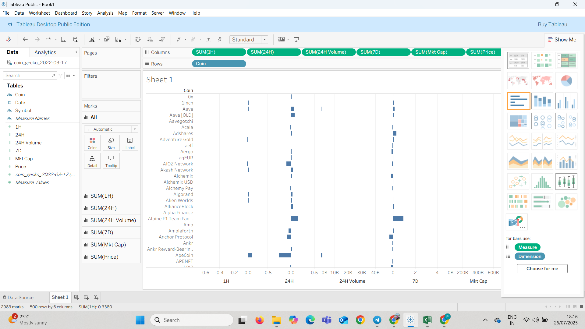
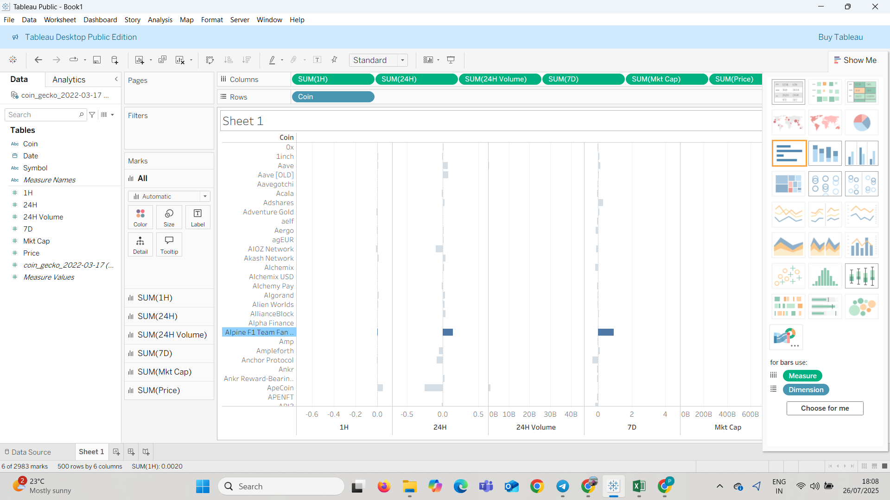

# 📊 Cryptocurrency Market Visualization (Tableau Project)

An interactive Tableau dashboard built using real-world data from CoinGecko. This project visualizes cryptocurrency market performance across multiple timeframes, highlighting trends, outliers, and investment patterns.

---

## 🧩 Dataset

The dataset `t.xlsx` was sourced from CoinGecko and includes:

- 📈 **1H, 24H, and 7D Price Change (%)**
- 💰 **24H Trading Volume**
- 🧠 **Market Capitalization**
- 🔢 **Current Price**
- 🪙 **Coin Names**

📂 Located in the `/data` folder.

---

## 📈 Visualizations

Built with **Tableau Public**, these visualizations help explore how various coins behave over time.

### 📌 Visualization 1: Overview Dashboard

- Bar chart comparing coins on multiple metrics: **price change**, **volume**, and **market cap**.
- Identifies which coins are gaining/losing traction short-term (1H/24H) vs long-term (7D).
- Provides side-by-side comparison using consistent visual scales.

---

### 📌 Visualization 2: Expanded Metric View

- Highlights specific coins with sharp changes.
- Allows visual filtering based on timeframes (1H, 24H, 7D).
- Great for spotting volatility or market spikes.

---

## 🎯 Key Insights

✔️ **Short-term movers** can be spotted using 1H and 24H price change bars.

✔️ Coins with **high 7D gains** might reflect longer-term growth or momentum.

✔️ **Large 24H trading volumes** usually reflect hype, news, or active speculation.

✔️ Comparing **market caps** reveals coin maturity and investment scale.

---

## 🛠 Tools Used

- **🧩 Tableau Public Edition**
- **📊 Microsoft Excel**
- **🌐 CoinGecko API / Data Download**

---

## 🚀 How to Recreate the Dashboard

1. Open Tableau Public.
2. Load the dataset from `/data/t.xlsx`.
3. Drag `Coin` to **Rows**.
4. Drag metrics (`1H`, `24H`, `7D`, `Price`, `Market Cap`, `24H Volume`) to **Columns**.
5. Use **bar chart** and apply filters/sorting for comparison.
6. Add color encodings and tooltips for better UX.

---

## 📦 Project Structure

